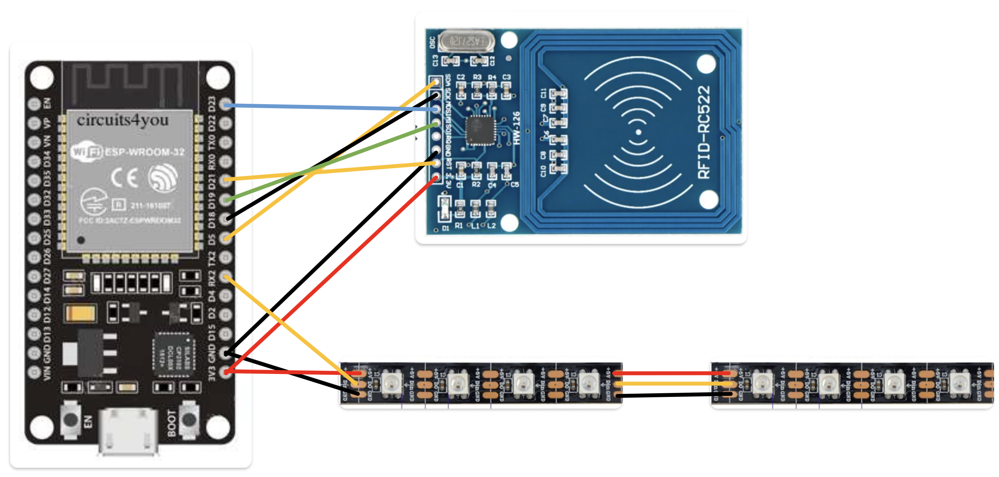
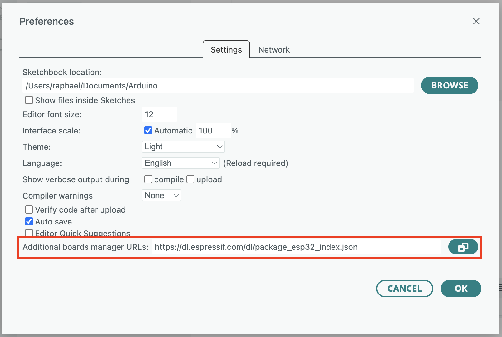
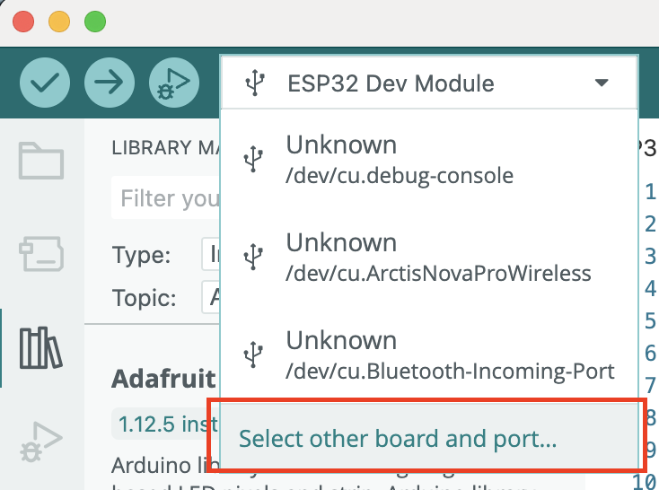
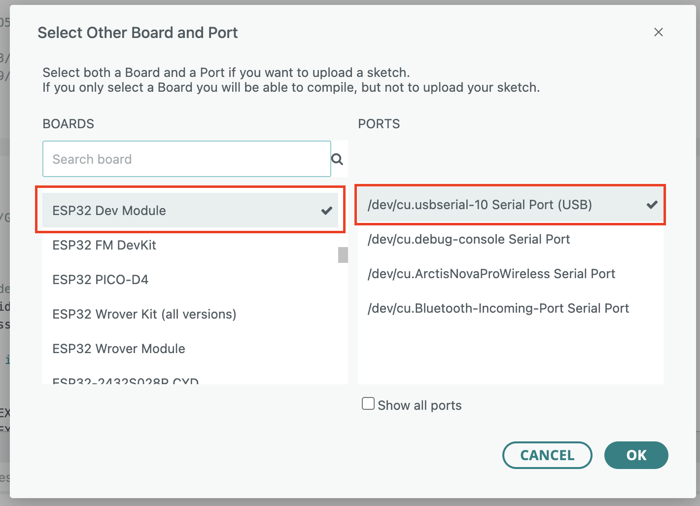
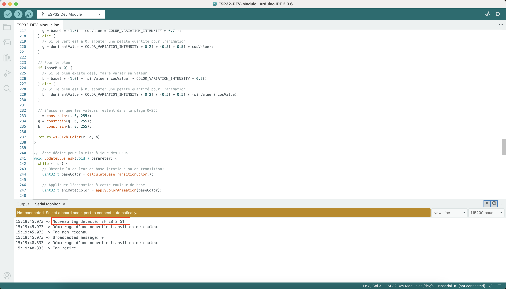
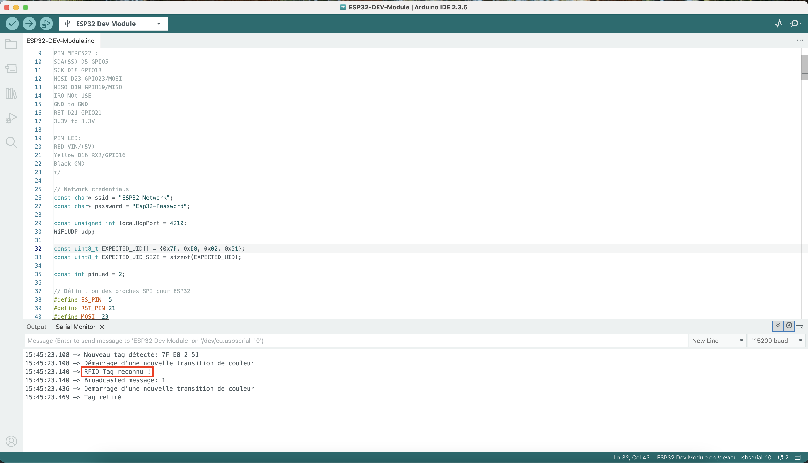

# 

## Matériel utilisé

- 1 microcontroler ESP32-32D
- 2 Tag RFID 13,56 MHz de 2.8 cm de diamètre (taille standard)
- 8 leds WS2812B de 60 led/metre coupé en 2 bandes de 4 leds
- 1 lecteur RFID RC522
- 1 socle pour ESP32 MRD068A
- 1 cable usb vers usb-c
- 1 adaptatuer usb vers prise electrique 5v. (Il est aussi possible de brancher le cable sur une prise usb d'un ordinateur.)

**ATTENTION : Si l'adaptatuer usb est supérieur a 5v le microcontroler ESP32 risque de griller.**

## Schéma electrique

## Contenu

- Dossier ESP32-DEV-Module
- STM32-F4
- Modèles 3D

## Modèles 3D

Ce dossier contient les fichiers prêts pour impression 3D du boitier et des figurines

## STM32-F4

Ce dossier contient une version abandoné du code pour un microcontroler STM32.
Ce code fonctionne en liaison série USB mais n'a pas été maintenu et mis a jour.

## ESP32-DEV-Module

Ce dossier contient le code pour le microcontroler ESP32 qui est utilisé pour ce projet.

### Bibliotèque utilisé

- Adafruit NeoPixel by Adafruit (version 1.12.5)
- MFRC522 by GithubCommunity (version 1.4.12)

### Modifier le tag rfid utilisé

Il est possible pour différente raison que le tag ne puisse plus être utilisé. 

Si c'est le tag du fossile il sufit de le remplacer. 
Mais si c'est le tag du Compsognatus veuillez ces étapes pour le remplacer :

1) Installer Arduino IDE (https://www.arduino.cc/en/software/)
2) Ouvrer avec Arduino IDE le fichier ESP32-DEV-Module.ino
3) Dans ArduinoIDE --> Preferences --> Settings sous "Additional boards manager URLs:" ecrir https://dl.espressif.com/dl/package_esp32_index.json puis cliquer sur ok

4) Dans le menu principal cliquer sur la carte puis sur "Select other board and port..."

5) Brancher l'ESP32 a l'ordinateur avec un cable laissant passé les données
6) Choisir pour BOARDS "ESP32 Dev Module" et le Port qui s'est affiché quand l'ESP32 a été branché a l'ordinateur puis cliqué sur ok

7) Apuillé sur le logo  situé en haut a droite
8) Présenté le nouveaux tag sur le présentoir. Le message "Nouveau tag détecté :" devrait apparaitre. Noté de côté la valeur indiqué après le message. (Dans cette exemple 7F E8 2 51)

9) Dans le fichier ESP32-DEV-Module.ino aller a la variable 32 : "const uint8_t EXPECTED_UID[] = {...}". Remplacer l'interieur des "{}" par la valeur noté a l'étape 8 avec les modifications suivantes :
- Si un groupe est composé de un seul caractère ajouté un 0 devant (Exemple : 7F E8 2 51 --> 7F E8 02 51)
- Ajouter 0x devant chaque groupe (Exemple : 7F E8 02 51 --> 0x7F 0xE8 0x02 0x51)
- séparer les groupes par une virgulle (Exemple : 0x7F 0xE8 0x02 0x51 --> 0x7F, 0xE8, 0x02, 0x51)
Pour notre exemple la ligne est const uint8_t EXPECTED_UID[] = {0x7F, 0xE8, 0x02, 0x51};
10) Appuyé sur logo  situé en haut a gauche
11) Après la fin de l'upload vérifier que le tag et bien reconu et affiche le message "RFID Tag reconnu !"
